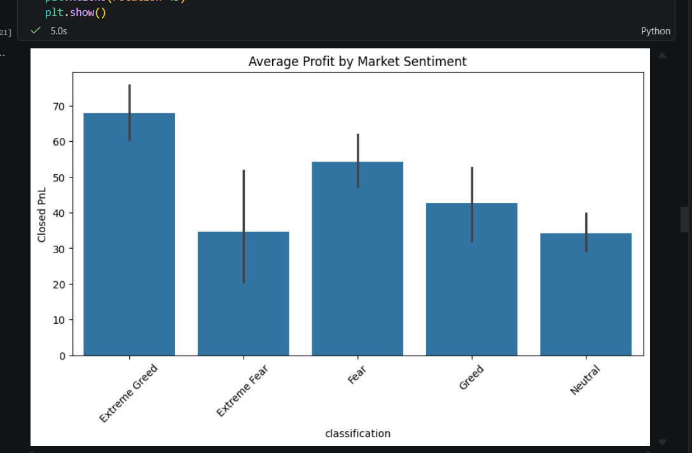
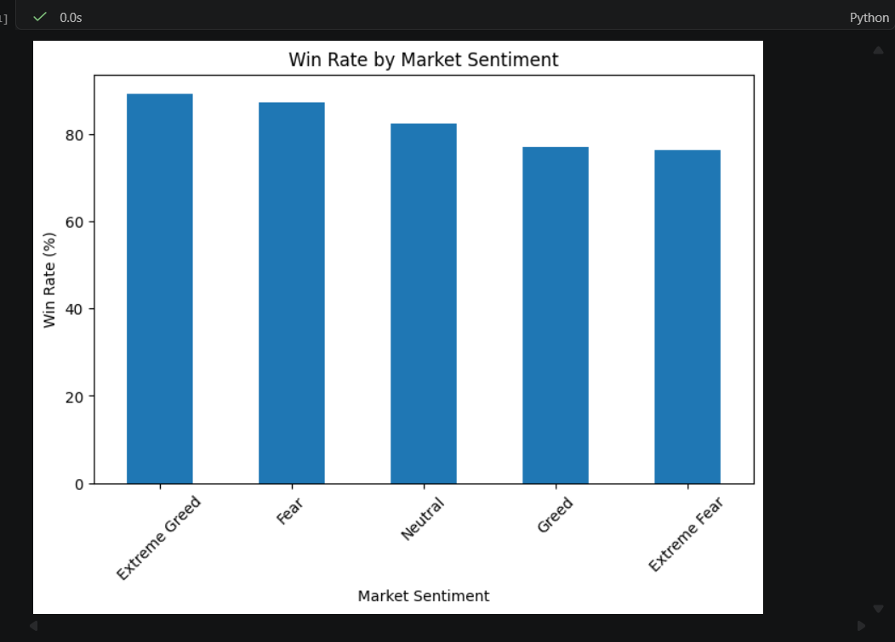
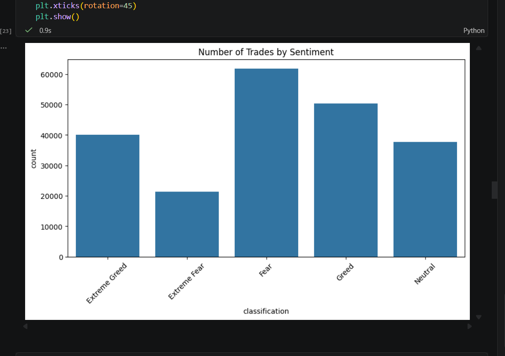

# Bitcoin Market Sentiment vs Trader Performance Analysis

## Project Overview

This project analyzes the relationship between Bitcoin market sentiment and trader performance using the Bitcoin Fear & Greed Index and historical trading data from Hyperliquid.

The objective is to investigate how different market sentiment conditions influence trader profitability, win rates, trading activity, and position sizing.

---

## Objectives

* Analyze trader performance under different market sentiment conditions.
* Compare profitability across Fear, Greed, Extreme Fear, Extreme Greed, and Neutral markets.
* Calculate win rates for each sentiment category.
* Examine trading behavior through trade size and fee analysis.
* Generate actionable insights from the data.

---

## Datasets Used

### 1. Bitcoin Fear & Greed Index Dataset

Contains:

* Date
* Fear & Greed Value
* Sentiment Classification

### 2. Hyperliquid Historical Trader Dataset

Contains:

* Account
* Coin
* Execution Price
* Trade Size
* Trade Direction
* Closed PnL
* Fee
* Timestamp
* Position Information

---

## Tools & Libraries

* Python
* Pandas
* NumPy
* Matplotlib
* Seaborn
* Jupyter Notebook

---

## Methodology

1. Loaded and explored both datasets.
2. Performed data cleaning and preprocessing.
3. Converted timestamp fields into a common date format.
4. Merged trading data with sentiment data.
5. Conducted exploratory data analysis (EDA).
6. Generated visualizations and performance metrics.
7. Extracted key insights and conclusions.

---

## Visualizations

## Visualizations

### Average Profit by Market Sentiment

### Win Rate by Market Sentiment

### Number of Trades by Sentiment

### Profitability Analysis

* Extreme Greed produced the highest average trader profitability.
* Extreme Fear produced the lowest average profitability.

### Win Rate Analysis

* Extreme Greed achieved the highest win rate (89.17%).
* Extreme Fear recorded the lowest win rate (76.22%).

### Trade Size Analysis

* Fear periods exhibited the largest average trade size.
* Extreme Greed showed the smallest average trade size despite the highest win rate.

### Trading Activity

* Fear periods generated the highest number of profitable trades.
* Market sentiment demonstrated a strong relationship with trading outcomes.

---

## Conclusion

The analysis indicates that Bitcoin market sentiment significantly influences trader performance. Traders generally achieved higher profitability and win rates during optimistic market conditions, while highly fearful periods were associated with lower performance metrics.

These findings suggest that sentiment indicators can be useful in understanding market behavior and evaluating trading strategies.

---

## Repository Structure

bitcoin-sentiment-trader-analysis/
│
├── Bitcoin_Market_Sentiment_vs_Trader_Performance.ipynb
├── README.md
└── images/

---

## Author

Prayash Sharma
AI/ML Student

